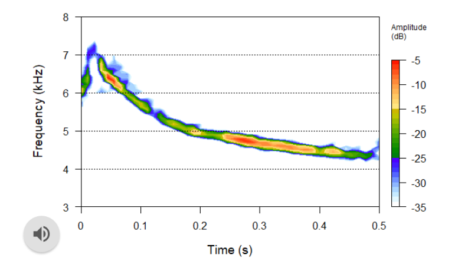
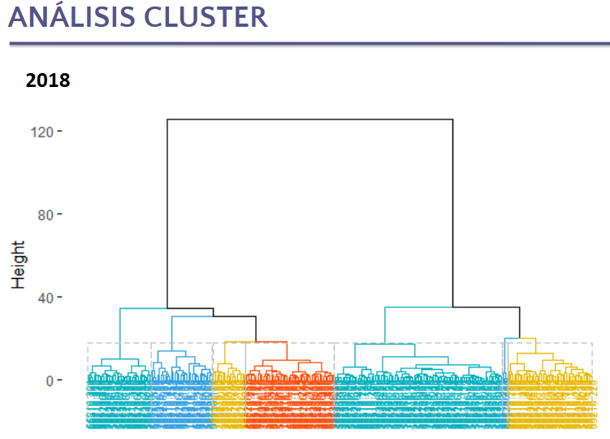

# 🎧🐟 Bioacoustics Analysis – Final Project

Welcome to this exploration of sound and science!  
This repository contains the final analysis from our bioacoustics research course:  
🧪 *“Principios de Comunicación Acústica” – 2020*, conducted as part of a collaborative project using real-world data from Gisela Giardino.

Fellow students as part of a hands-on research experience 🧑‍🔬.

---

## 🔍 What's inside?

Our analysis focuses on understanding variation in acoustic signals through multivariate analysis techniques:

✨ **Included Methods**  
- 📊 Principal Component Analysis (**PCA**)  
- 🧬 Linear Discriminant Analysis (**DFA**)  
- 🌐 Hierarchical Clustering + K-means  
- 📈 Correlation & Similarity Analysis  
- 🖼️ Plots with `ggplot2`, `ggord` & more!
## Results
<p align="center">
  
  
</p>
---

## 📦 Requirements

To run the script, install the following R packages:

```r
install.packages(c("vegan", "ade4", "ggplot2", "MASS", "devtools", "cluster", "factoextra", "proxy"))
devtools::install_github("fawda123/ggord", force = TRUE)

# Bioacoustics Final Analysis – Acoustic Communication Course (2020)

# This script is part of a research-based course on bioacoustics. 
# The project was developed as a group during the course "Principios de Comunicación Acústica".
# This specific analysis focuses on PCA, discriminant analysis, and clustering of acoustic features 
# from aquarium recordings.

# INSTALL PACKAGES (if not installed)
install.packages(c("vegan", "ade4", "ggplot2", "MASS", "devtools", "cluster", "factoextra", "proxy"))
library(devtools)
install_github("fawda123/ggord", force = TRUE)

# LOAD LIBRARIES
library(vegan)
library(ade4)
library(ggplot2)
library(MASS)
library(ggord)
library(cluster)
library(factoextra)
library(proxy)

# SET WORKING DIRECTORY
setwd("E:/ACUSTICA/Principios de Comunicacion Acustica 2020")

# LOAD DATA
SeleccionAq <- read.delim("clipboard")  # or use read.table("archivo.txt")
SeleccionAq$Año <- factor(SeleccionAq$Año)

# STANDARDIZE NUMERICAL DATA
AQ_est <- scale(SeleccionAq[6:12])
colMeans(AQ_est)

# PCA ANALYSIS
pca1 <- prcomp(AQ_est)
plot(pca1, type = "l")
summary(pca1)

# ALTERNATIVE PCA INCLUDING SCALING
pca <- prcomp(SeleccionAq[5:16], scale = TRUE)
summary(pca)

# CORRELATION MATRIX AND EIGENVALUES
CorDat <- cor(pca)
eigVal <- eigen(CorDat)
eigVal$values
sum(eigVal$values)

# SCATTER PLOT PCA 1 VS 2
plot(pca1$x[,1], pca1$x[,2])
biplot(pca1)

# PCA LOADINGS
carga <- pca$rotation[,1]
puntajes <- abs(carga)
orden_puntaje <- sort(puntajes, decreasing = TRUE)
orden2 <- names(orden_puntaje)
pca$rotation[orden2, 1]

# LINEAR DISCRIMINANT ANALYSIS
dfa <- lda(Año ~ AQ_est, SeleccionAq)
plot(dfa)
ggord(dfa, SeleccionAq$Año, ellipse = FALSE, arrow = 0)
ggord(dfa, SeleccionAq$Año, ellipse = TRUE, arrow = 0)

# HIERARCHICAL CLUSTERING
# Distance matrix
d <- dist(SeleccionAq, method = "euclidean")
H.fit <- hclust(d, method = "ward.D")
plot(H.fit)
groups <- cutree(H.fit, k = 7)
rect.hclust(H.fit, k = 7, border = "red")

# ADVANCED CLUSTERING
# Note: replace with actual path to your Excel file
# Example loading data:
# corr2018 <- readXL("BatchCorr2018.xlsx", sheet = "BatchCorrOutput2018 (2)")
# Use read.xlsx() or similar if needed
